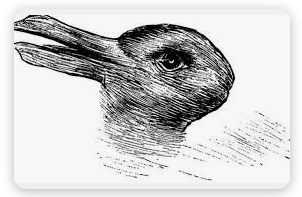

# Cuestionario: Kuhn y los paradigmas

1. ¿Qué crítica realiza Kuhn a la perspectiva de Popper?

2. Defina los conceptos de ‘comunidad científica’, ‘anomalía’, ‘revolución científica’ y ‘ejemplares’.

3. Describa las distintas etapas que se reiteran en la historia de la ciencia según Kuhn.

4. En qué consiste la afirmación de que dos paradigmas son inconmensurables.

5. ¿En qué sentido afirma Kuhn que al cambiar de paradigma los científicos habitan distintos mundos?

6. En qué sentido sirve a Kuhn la imagen del pato-conejo para explicar el cambio que se produce en la percepción del científico al cambiar el paradigma.

7. De los ejemplos ofrecidos por Kuhn para fundamentar la inconmensurabilidad perceptual deténgase y describa sólo en el caso de la mutabilidad del cielo en la revolución copernicana.

8. ¿En qué sentido afirma Kuhn que la idea de un lenguaje neutro observacional es insostenible?

9. Reflexione como afectan las ideas kuhnianas a la posición empirista.

10. ¿Hay progreso en la ciencia para Kuhn?

## Respuests

1. ¿Qué crítica realiza Kuhn a la perspectiva de Popper?


Para entender la crítica de Kuhn a Popper, hay que ver que Kuhn era esencialmente un historiador de la ciencia. Al mirar cómo trabajaban los científicos en el pasado, se dio cuenta de que la idea popperiana de que la ciencia progresa mediante una simple sucesión de conjeturas y refutaciones era "sobresimplificada" y no encajaba con la realidad.

Los reproches concretos que Kuhn le hace a la metodología de Popper se pueden resumir en tres puntos clave:

* **Las teorías conviven con los problemas:** Popper planteaba que si una teoría es contradicha por un experimento, debe ser refutada y abandonada enseguida. Kuhn le responde que, en la práctica real, las teorías conviven desde su nacimiento con casos que las contradicen —lo que él llama anomalías— y no por eso los científicos las tiran a la basura.

* **Los experimentos no deciden los cambios de forma tan simple:** Para Popper, un experimento crucial que corrobora una hipótesis y refuta otra es suficiente para cambiar de teoría. Kuhn argumenta que el abandono de un marco teórico y la aceptación de uno nuevo es un proceso muchísimo más complejo que no se reduce a un mero resultado de laboratorio.

* **Hay dos tipos de cambios cualitativamente diferentes:** Popper veía toda la historia de la ciencia de la misma manera: proponer teorías y reemplazarlas al ser refutadas. Kuhn demuestra que esto es un error porque existen cambios conservadores, donde no se abandona el marco ni las leyes con las que se investiga, y cambios revolucionarios, donde hay un verdadero borrón y cuenta nueva. Al ser cualitativamente diferentes, no se los puede medir con la misma vara falsacionista.

En resumen, la crítica de Kuhn es que el aparato conceptual de Popper es insuficiente porque no logra captar la verdadera complejidad del fenómeno científico. Mientras Popper proponía cómo debería funcionar la ciencia en un manual ideal, Kuhn demostró que la ciencia real avanza protegiendo sus paradigmas y que estos son, en su día a día, irrefutables.

---

2. Defina los conceptos de ‘comunidad científica’, ‘anomalía’, ‘revolución científica’ y ‘ejemplares’.


Para entender el planteo de Kuhn, estos cuatro conceptos son fundamentales porque funcionan como los engranajes de toda su teoría. Se pueden definir de la siguiente manera:

* **Comunidad científica:** Es el conjunto de investigadores que comparten una misma mirada sobre el mundo, usan los mismos instrumentos y se rigen por las mismas reglas. Si no comparten este marco común, como pasa en las etapas iniciales de una disciplina o en las ciencias sociales, existen científicos sueltos pero todavía no una comunidad propiamente dicha.

* **Anomalía:** En el día a día, los científicos se dedican a resolver problemas que ya saben que tienen solución asegurada. Pero a veces, la naturaleza se planta y viola las expectativas creadas por el marco de trabajo. Cuando un problema se resiste, se vuelve rebelde y se reconoce abiertamente que las cosas no encajan como deberían, ese dolor de cabeza pasa a llamarse anomalía.

* **Revolución científica:** Es un cambio drástico, un verdadero "borrón y cuenta nueva". No significa que la ciencia avanza sumando un poquito más de conocimiento a lo que ya había de forma acumulativa. Una revolución ocurre cuando el viejo marco de trabajo se desmorona por las crisis y es reemplazado por completo por un nuevo paradigma que es totalmente incompatible con el anterior.

* **Ejemplares:** Dentro de lo que compone a un paradigma, los ejemplares son los modelos de solución de problemas concretos. Son esos casos prácticos y exitosos que los estudiantes analizan en los manuales para aprender cómo se debe investigar. Sirven como la guía práctica para saber cómo resolver los futuros acertijos de la profesión.

En pocas palabras, una **comunidad científica** trabaja guiada por sus **ejemplares** prácticos hasta que tropieza con **anomalías** que no puede resolver, lo que tarde o temprano la termina empujando hacia una **revolución científica**.

---


3. Describa las distintas etapas que se reiteran en la historia de la ciencia según Kuhn.

Para Kuhn, la ciencia no avanza en línea recta sumando conocimientos de forma acumulativa. La historia de cualquier disciplina es un ciclo repetitivo que pasa por etapas bien marcadas:

* **Época preparadigmática:** Es el punto de partida. Hay un caos teórico porque coexisten un montón de escuelas compitiendo entre sí. Cada grupo tiene sus propias reglas, leyes e instrumentos. Discuten tanto sobre los fundamentos que, al no tener una base común compartida, no logran un progreso real.

* **Ciencia normal:** Esta etapa arranca cuando la comunidad se pone de acuerdo y adopta un marco común, que es el paradigma. La actividad se estabiliza. Los científicos dejan de discutir sobre lo básico y se dedican a resolver "rompecabezas", es decir, problemas concretos que el propio paradigma les garantiza que tienen solución. Es una época de trabajo muy productivo y conservador.

* **Aparición de anomalías y Crisis:** Tarde o temprano, los investigadores tropiezan con problemas rebeldes que violan las expectativas del paradigma. Al principio se ignoran o se aíslan, pero cuando estas anomalías se acumulan, afectan los cimientos del sistema o responden a una necesidad social urgente, los científicos pierden la fe y el paradigma entra en crisis.

* **Ciencia extraordinaria y Revolución científica:** Con la crisis, las reglas del manual se relajan y los investigadores (por lo general los más jóvenes) empiezan a buscar caminos alternativos por fuera de la ortodoxia. A esa práctica libre se la llama ciencia extraordinaria. Si una de estas nuevas propuestas tiene éxito, resuelve las anomalías y promete un horizonte mejor, la comunidad se muda de bando. Cuando el nuevo paradigma reemplaza por completo al anterior, se concreta la revolución científica.

* **Nueva ciencia normal:** Una vez que el nuevo paradigma se asienta y es aceptado por la comunidad, el ciclo se reinicia. Los científicos vuelven a trabajar tranquilos resolviendo los nuevos rompecabezas de este marco, hasta que en un futuro aparezcan nuevas anomalías y todo empiece otra vez.

---

4. En qué consiste la afirmación de que dos paradigmas son inconmensurables.

Cuando Kuhn dice que dos paradigmas son inconmensurables, lo que está planteando es que dos marcos científicos rivales no se pueden comparar usando un patrón de medida común u objetivo. No hay una balanza neutral que nos permita decir de forma lógica y definitiva que uno es mejor que el otro. 

Esto pasa por varias razones muy concretas que complican la comunicación entre los científicos de bandos diferentes:

* **Mundos con distintos habitantes:** Cada paradigma ve el universo compuesto por cosas diferentes. Para Newton el mundo está formado por átomos afectados por fuerzas, mientras que para Aristóteles se compone de elementos totalmente distintos. Al no ponerse de acuerdo sobre qué existe en la realidad, es imposible que midan sus teorías de la misma manera.
* **Problemas y normas diferentes:** Lo que para un paradigma es un problema urgente que requiere solución, para el rival puede ser algo irrelevante o que directamente no tiene sentido investigar. Cada marco define sus propias reglas y normas para decidir qué cuenta como una solución válida.
* **Las mismas palabras significan cosas distintas:** Aunque el nuevo paradigma incorpore gran parte del vocabulario anterior, los términos terminan redefinidos. Por ejemplo, la palabra *masa* se mantiene en la física relativista, pero cambia su significado porque ya no se conserva como en la física newtoniana, sino que varía según la velocidad. Con la revolución copernicana pasó igual con el término *planeta*: para los ptolemaicos el Sol y la Luna lo eran y la Tierra no, mientras que para los heliocentristas la Tierra pasó a ser un planeta y el Sol dejó de serlo.
* **Los valores dependen del paradigma:** Si bien los científicos de bandos opuestos pueden compartir ciertos valores (como la simplicidad o la capacidad predictiva), suelen diferir en cómo los aplican. En la revolución copernicana, el uso de elipses parecía más simple para algunos porque usaba una sola línea en lugar de muchas combinaciones de círculos, pero para otros el círculo seguía siendo una figura mucho más simple que la elipse.

En resumen, la inconmensurabilidad significa que no existe un argumento lógico perfecto ni una base común neutral que demuestre que un paradigma es superior a otro, porque representan formas incompatibles de ver el mundo y de hacer ciencia.

---

5. ¿En qué sentido afirma Kuhn que al cambiar de paradigma los científicos habitan distintos mundos?

Kuhn afirma que los científicos habitan distintos mundos tras una revolución porque la realidad que perciben no está hecha de datos puros, sino que está completamente filtrada por la teoría que sostienen. Al cambiar el marco conceptual, cambia la experiencia perceptiva misma del investigador.

Esta afirmación se sostiene bajo los siguientes puntos clave:

* **La observación está cargada de teoría:** Un científico no se enfrenta al universo con la mente en blanco. Lo que ve en su laboratorio o en el cielo ya está interpretado por los conceptos de su paradigma. Por lo tanto, ante el mismo estímulo visual, dos científicos de paradigmas rivales perciben cosas completamente diferentes.
* **Reordenamiento conceptual del entorno:** Cuando un paradigma es reemplazado por otro, los mismos objetos que ya se conocían se reubican en categorías totalmente nuevas y se relacionan entre sí de otra manera. El entorno del científico se transforma de golpe; objetos que antes eran familiares ahora se perciben bajo una naturaleza distinta.
* **El ejemplo del péndulo:** Para entenderlo de forma práctica, Kuhn muestra cómo Aristóteles y Galileo miraban el mismo objeto: una piedra que se balancea atada a una cuerda. Aristóteles, bajo su paradigma, veía un cuerpo pesado que caía con dificultad hacia su lugar natural de reposo. Galileo, en cambio, miraba exactamente lo mismo y percibía un péndulo, es decir, un objeto que lograba conservar su movimiento de forma repetida. El objeto físico era el mismo, pero el mundo en el que operaba cada científico era conceptualmente distinto.

En conclusión, los científicos habitan mundos diferentes porque el universo de la ciencia no se define por las cosas materiales que están ahí afuera, sino por la forma en que el paradigma permite agruparlas, verlas y trabajar con ellas.

---

6. En qué sentido sirve a Kuhn la imagen del pato-conejo para explicar el cambio que se produce en la percepción del científico al cambiar el paradigma.




Kuhn utiliza la ilusión óptica del pato-conejo, inspirada en la psicología de la Gestalt, como una analogía perfecta para ilustrar cómo funciona la conversión perceptiva y mental de un científico cuando pasa de un paradigma a otro. 

La imagen sirve para explicar este proceso en los siguientes sentidos:

* **La transformación es instantánea:** Quien mira el dibujo no pasa por un proceso largo de deducción para ver el pato o el conejo; el cambio de percepción ocurre de golpe. De la misma manera, el paso de un paradigma a otro no es una transición gradual basada en la acumulación de datos, sino un cambio repentino y absoluto en la mente del científico.

* **Los datos no cambian, cambia la forma:** En la ilusión óptica, las líneas sobre el papel siguen siendo exactamente las mismas en todo momento. Sin embargo, el observador percibe un animal completamente distinto según el marco visual que aplique. En la ciencia ocurre lo mismo: los datos experimentales o los estímulos visuales pueden ser idénticos, pero el científico los organiza y los interpreta de una forma totalmente nueva bajo el nuevo paradigma.

* **No hay un punto medio:** Uno puede ver el pato o puede ver el conejo, pero es imposible ver ambos animales al mismo tiempo. Esto refleja la incompatibilidad de los paradigmas. El científico no puede mantener un pie en cada bando; se está en un marco de pensamiento o se está en el otro.

En definitiva, la imagen del pato-conejo le sirve a Kuhn para demostrar que las revoluciones científicas no son simplemente nuevas interpretaciones de datos viejos, sino transformaciones radicales en la forma en que los científicos perciben la realidad de su trabajo.

---

7. De los ejemplos ofrecidos por Kuhn para fundamentar la inconmensurabilidad perceptual deténgase y describa sólo en el caso de la mutabilidad del cielo en la revolución copernicana.

Kuhn utiliza el caso de la astronomía durante la revolución copernicana para demostrar cómo un cambio de paradigma altera la percepción directa que los científicos tienen del mismo fenómeno físico. 

El análisis de este caso histórico se puede resumir en los siguientes puntos:

* **El cielo inmutable del geocentrismo:** Bajo el viejo paradigma ptolemaico e inspirado en las ideas aristotélicas, los astrónomos occidentales estaban convencidos de que los cielos eran perfectos, eternos e inmutables. Todo lo que cambiaba ocurría en la Tierra. Debido a este filtro conceptual, cuando miraban al cielo y aparecía un fenómeno nuevo, sus ojos simplemente lo ignoraban o lo interpretaban de forma errónea, catalogándolo como un gas o un reflejo en la atmósfera terrestre y no como un cambio real en el espacio exterior.

* **La apertura visual con el heliocentrismo:** Una vez que Copérnico propuso que la Tierra se movía y que los cielos no eran esa esfera estática y perfecta, el marco conceptual de los astrónomos cambió por completo. Casi de inmediato, los científicos empezaron a "ver" cosas en el cielo que siempre habían estado ahí, pero que antes les resultaban invisibles.

* **El descubrimiento de nuevos astros:** El cambio de paradigma habilitó a los astrónomos a percibir la mutabilidad del cosmos. Un ejemplo claro fue el avistamiento repentino de estrellas variables, cometas que cruzaban el espacio y la famosa supernova observada por Tycho Brahe. Lo fascinante para Kuhn es que estos descubrimientos no ocurrieron porque se hubieran inventado mejores telescopios, sino porque el nuevo paradigma permitió a los astrónomos mirar el firmamento con otra mentalidad.

En resumen, el caso de la mutabilidad del cielo demuestra la inconmensurabilidad perceptual: los astrónomos pre-copernicanos y los post-copernicanos miraban exactamente las mismas estrellas, pero habitaban mundos visuales distintos. El cambio teórico no solo modificó las ideas, sino que transformó lo que los científicos eran capaces de ver.

---

8. ¿En qué sentido afirma Kuhn que la idea de un lenguaje neutro observacional es insostenible?

Kuhn afirma que la idea de un lenguaje observacional neutro es insostenible porque es imposible separar lo que vemos de lo que sabemos. Los filósofos empiristas y positivistas buscaban un lenguaje puro, basado únicamente en sensaciones físicas directas, que sirviera como juez imparcial para comparar dos teorías. Kuhn destruye esa posibilidad argumentando lo siguiente:

* **La experiencia está contaminada por la teoría:** No existen los "datos puros" o las observaciones limpias. Desde el momento en que un científico describe lo que ve en un laboratorio, ya está usando conceptos, nombres y categorías que pertenecen a un paradigma específico. El lenguaje que usamos para describir la realidad ya viene con la teoría incorporada.
* **El entrenamiento científico moldea la visión:** Un estudiante de ciencia no aprende a mirar de forma neutral. Se lo educa mediante ejemplares y manuales para que aprenda a aislar ciertos estímulos e ignorar otros. Lo que un científico experimenta al mirar un aparato no es una sensación biológica cruda, sino una percepción entrenada y guiada por las expectativas del paradigma.
* **El fracaso de los proyectos de traducción:** Kuhn señala que todos los intentos de los filósofos por inventar un lenguaje observacional puro y puramente empírico fracasaron. Cada vez que se intenta crear una red conceptual que describa las cosas tal como son, se termina cayendo en presupuestos teóricos encubiertos.

En conclusión, la idea de un lenguaje neutro es insostenible porque no hay un escalón previo a la teoría. No podemos expresar lo que vemos sin usar el lenguaje de nuestro propio paradigma, lo que significa que la base empírica de la ciencia siempre estará ligada al marco conceptual desde el cual se la mire.

---

9. Reflexione como afectan las ideas kuhnianas a la posición empirista.

Las ideas de Kuhn sacuden por completo las bases de la posición empirista tradicional, la cual sostenía que el conocimiento científico se construye de abajo hacia arriba, acumulando observaciones neutrales y puras sobre la realidad. Al introducir la historia real de la ciencia y la psicología de la percepción, Kuhn demuestra que ese modelo idealizado es insostenible.

El impacto de las tesis kuhnianas en el empirismo se puede sintetizar en los siguientes puntos de quiebre:


* **Destrucción del mito de la base empírica neutral:** Para el empirismo, los hechos observados son datos puros y objetivos que sirven como juez último para comprobar si una teoría es verdadera o falsa. Kuhn demuestra que esos hechos no existen de forma aislada, ya que toda observación está "cargada de teoría". Si los datos cambian cuando cambia el paradigma, entonces la experiencia directa ya no puede ser un juez neutral ni independiente.

* **Fin del progreso por acumulación lineal:** Los empiristas concebían la historia de la ciencia como un edificio que crece de manera continua, donde cada generación suma nuevos ladrillos de evidencia empírica. Kuhn rompe este esquema al introducir las revoluciones científicas. El paso de un paradigma a otro no es acumulativo, sino destructivo: el nuevo marco no absorbe al anterior, sino que lo reemplaza al redefinir por completo el mundo que se investiga.

* **Inclusión de factores no racionales en la elección de teorías:** El empirismo defendía que un científico elige una teoría basándose exclusivamente en criterios lógicos, matemáticos y de evidencia empírica. Kuhn, al postular la inconmensurabilidad, señala que la evidencia nunca es suficiente para forzar el cambio de paradigma. En la práctica, la comunidad científica se vuelca hacia una nueva teoría inflada por factores comunitarios, históricos, estéticos o de fe en la promesa del nuevo marco, elementos que el empirismo consideraba ajenos a la racionalidad científica.

En definitiva, las ideas de Kuhn afectan al empirismo al quitarle su pilar más sagrado: la creencia de que la ciencia es un reflejo fiel, acumulativo y puramente objetivo del mundo, gobernado únicamente por la observación sensorial.


--- 


10. ¿Hay progreso en la ciencia para Kuhn?

Sí, para Kuhn hay progreso en la ciencia, pero redefine por completo lo que entendemos tradicionalmente por esa palabra. Él rechaza la idea de que la ciencia progresa de forma lineal acercándose cada vez más a una verdad absoluta o a una representación fiel de la naturaleza tal cual es.

Para entender cómo funciona el progreso según su planteo, hay que dividirlo en dos sentidos muy diferentes:

* **El progreso dentro de la ciencia normal (acumulativo):** Durante los períodos de ciencia normal, el progreso es evidente, innegable y muy parecido al de la visión tradicional. Como la comunidad científica comparte un mismo paradigma y nadie discute las reglas del juego, todos empujan para el mismo lado. El avance se da de forma acumulativa a medida que los investigadores resuelven con mayor éxito, rapidez y precisión los rompecabezas que el paradigma les propone.
* **El progreso a través de las revoluciones (no acumulativo):** Cuando ocurre una revolución científica y se cambia de paradigma, también hay progreso, pero este no se da por acumulación, sino por evolución. El nuevo paradigma no es "más verdadero" en un sentido absoluto, sino que es un instrumento mucho más eficiente y poderoso para resolver las anomalías con las que el viejo marco ya no podía lidiar. 

Kuhn utiliza una analogía muy clara con la teoría de la evolución de Darwin: la ciencia progresa de la misma manera en que evolucionan las especies vivas. La evolución no camina hacia un objetivo final perfecto o predeterminado por la naturaleza, sino que las especies cambian para adaptarse mejor a su entorno a partir de lo que ya son. 

En conclusión, para Kuhn la ciencia avanza *desde* lo que sabemos y los problemas que logramos dejar atrás, y no *hacia* una meta o verdad última. El progreso científico es real, pero es un proceso de desarrollo unidireccional y adaptativo, no una marcha hacia la verdad absoluta.


# Mapa Conceptual de la Epistemología de Kuhn

A continuación, se presenta la estructura dividida en los tres grandes pilares del cuestionario, organizada en diagramas de flujo lineales para facilitar su lectura y estudio:

### 1. El ciclo de la historia de la ciencia
Este esquema muestra cómo avanza el conocimiento a través del tiempo, intercalando fases pacíficas con quiebres radicales.

```text
[ PRECIENCIA ]
      │
      ▼ (La comunidad unifica criterios y adopta un marco común)
[ CIENCIA NORMAL ] ───► Trabajo de los científicos orientado por EJEMPLARES
      │
      ▼ (La naturaleza se planta y viola las expectativas del manual)
[ ANOMALÍAS ] ────► Problemas rebeldes que se acumulan sin solución
      │
      ▼ (Los investigadores pierden la fe en los cimientos del sistema)
[ CRISIS ]
      │
      ▼ (Aparece la CIENCIA EXTRAORDINARIA: investigación libre y sin reglas)
[ REVOLUCIÓN CIENTÍFICA ] ───► Borrón y cuenta nueva; caída del viejo paradigma
      │
      ▼ (Un nuevo candidato se asienta y el ciclo se reinicia)
[ NUEVA CIENCIA NORMAL ]
```

---

### 2. El fenómeno de la Inconmensurabilidad
Este desglose detalla por qué los científicos de bandos opuestos sufren una ruptura total en la comunicación y no se pueden entender.

```text
               ┌──► CONCEPTUAL: Las mismas palabras cambian de significado.
               │                (Ejemplo: "Planeta" o "Masa")
               │
               ├──► METODOLÓGICO: Cada bando tiene sus propios problemas urgentes,
               │                  reglas de laboratorio y valores (como la simplicidad).
INCONMENSURABILIDAD
(No hay una vara │
 común de medida)├──► PERCEPTUAL: Los científicos HABITAN MUNDOS DISTINTOS.
               │                La observación pura no existe. (Ejemplo: Péndulo)
               │
               └──► ANALOGÍA DEL PATO-CONEJO:
                    * La conversión mental es instantánea (Gestalt).
                    * Los datos son idénticos; la forma de verlos cambia.
                    * Es imposible mantener ambas visiones a la vez.
```

---

### 3. Rupturas con la Filosofía Tradicional
Este cuadro resume el impacto de las ideas de Kuhn frente a las posiciones dominantes de su época (Popper y los empiristas).

```text
   VS. KARL POPPER               VS. EMPIRISMO               EL PROGRESO REAL
─────────────────────         ────────────────────         ────────────────────
* Rechaza el falsacionismo   * El lenguaje neutro         * No es una marcha lineal
  lineal y continuo.           observacional es             hacia una verdad absoluta.
                               insostenible.
* Ante una falla, el                                       * En Ciencia Normal: es
  científico culpa su        * No se progresa sumando       acumulativo al resolver
  diseño, no a la teoría.      ladrillos de datos puros.    los rompecabezas.

* El dogmatismo inicial      * En las revoluciones        * En Revolución: es como
  es necesario para poder      influyen factores no         la evolución darwiniana;
  profundizar una idea.        racionales (comunidad/fe).   se avanza *desde* el caos.
```
